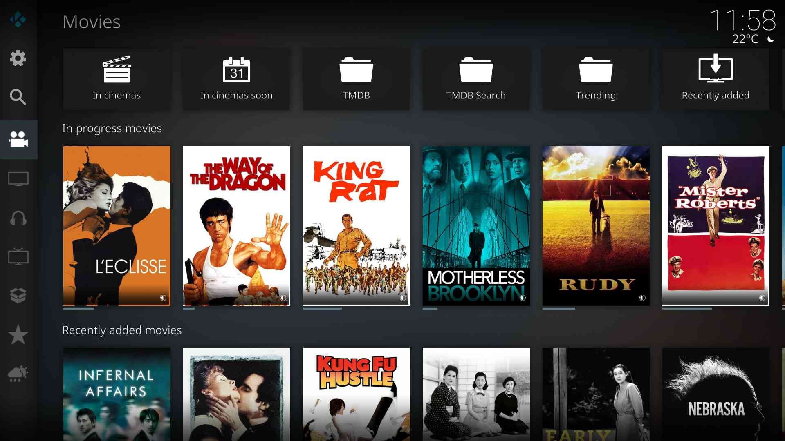
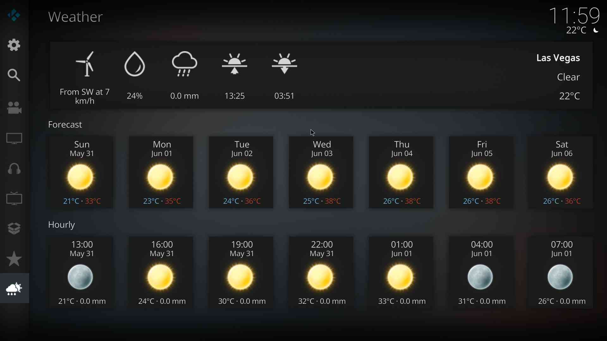

# Contuary Skin

## Features

Simple Mod of Kodi Default Skin (Estuary)

- Icons Only Main Menu
- Suitable for 16:9 displays only
- Scale the UI using [script.skin.contuary](https://github.com/kontell/script.skin.contuary/).
  - Settings -> Interface -> Skin -> Configure skin -> General -> Resolution

## Installation

Install via the [Kontell Repository](https://github.com/kontell/repository.kontell).

## Screenshots

