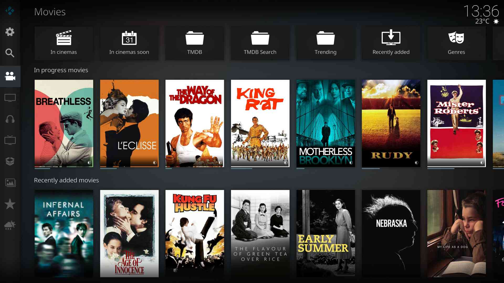

# Contuary Skin

## Features

Simple Mod of Kodi Default Skin (Estuary)

- Icons Only Main Menu
- Suitable for 16:9 displays only
- Scale the UI using [script.skin.contuary](https://github.com/kontell/script.skin.contuary/)
  - Settings -> Interface -> Skin -> Configure skin -> General -> Resolution
- [Kofin](https://github.com/kontell/plugin.video.kofin)
  - Adds download status glyphs to movie & show posters
  - Adds an entry to the global search dialog
  - SyncPlay & Who's watching buttons in the Movies categories widget
  - Generate an entire main menu section based on a Jellyfin library (not useful for dynamic libraries until [this](https://github.com/xbmc/xbmc/pull/29039) fix lands)
- [Kotome](https://github.com/kontell/plugin.audio.kotome)
  - Adds bookmark button to OSD when listening to audiobooks
- [Restore Music Queue](https://github.com/kontell/script.music.restore)
  - Adds recent queues button to music section
- [Embuary Info](https://github.com/kontell/script.embuary.info/)
  - Buttons on movies/ shows widgets can be toggled on/ off, plus TMDB search
- [Kofin Lyrics](https://github.com/kontell/script.kofin.lyrics)
  - Seamless lyrics overlay on fan-art when playing music

## Installation

Install via the [Kontell Repository](https://github.com/kontell/repository.kontell).

## Screenshots

